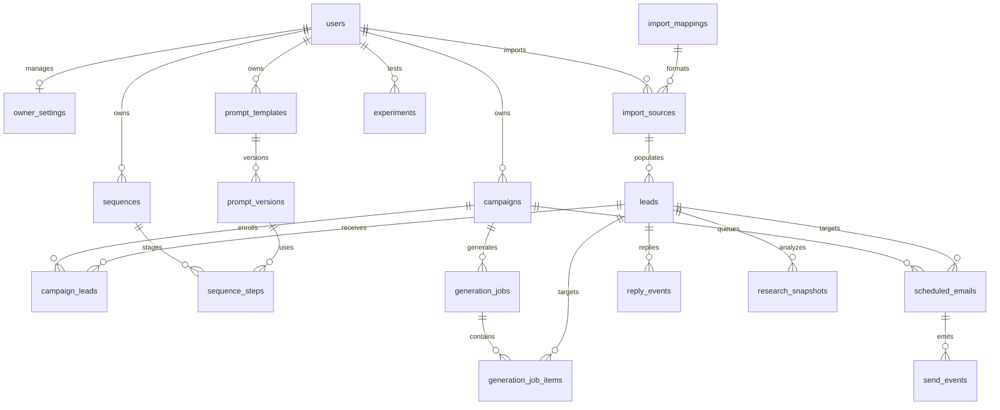

# Database Version 2 Migration Report
**Generic B2B Outreach Schema Implementation**

This report documents the schema design, SQL migration commands, local fallback SQLite mapping upgrades, data backfill scripts, automated testing suite, and rollback/downgrade directions for the OutreachOps AI generic outreach platform v2 architecture.

---

## 1. Migration Architecture and Design Goals

The OutreachOps AI database has been updated from a specialized ERP cold-email schema to a generic, highly flexible outreach B2B data model. The migration is **additive and fully non-destructive**, ensuring complete backward compatibility:
1. **Preserve Existing Fields**: Columns like `website_pain_points` and `erp_approach` are retained temporarily on the `leads` table to avoid breaking any legacy code.
2. **Safe Alters**: Alters on the existing `leads` and `campaigns` tables add nullable fields or sensible defaults.
3. **Data Backfills**: Existing plain-text unstructured data gets migrated automatically into generic JSONB fields (`custom_fields`) and prompt templates get mirrored into versioned prompt histories (`prompt_versions`).

---

## 2. Table Schemas and Relationships

Below is the entity-relationship mapping for the OutreachOps AI v2 schema:



### Table Definitions

1. **`owner_settings`**: Stores single-owner workspace brand settings, sender profile information, daily throttle caps, send window start/end hours, and banned copy phrases.
2. **`leads`**: Core lead profiles. Added generic fields (`first_name`, `last_name`, `job_title`, `tags`, `fit_score`, `fit_score_reasons`, `email_validation_status`, `custom_fields`).
3. **`import_sources`**: Logs imports from spreadsheets or CSV uploads, specifying mapping profiles, counts of rows, and success rates.
4. **`import_mappings`**: Defines mapping properties translating input headers (e.g., spreadsheet columns) to generic lead profile fields.
5. **`campaigns`**: Removed ERP constraints. Tracks marketing objectives, value propositions, specific offers, CTA guidelines, prompt templates, and sequence configurations.
6. **`campaign_leads`**: Tracks lead states inside active sequences (current step number, enrollment timestamps, stopped reasons).
7. **`prompt_templates` & `prompt_versions`**: Separates stable templates from versioned, immutable prompt template texts.
8. **`sequences` & `sequence_steps`**: Models sequential drip mailing pipelines with step intervals, subject guidelines, and exit conditions.
9. **`generation_jobs` & `generation_job_items`**: Tracks background AI content generation pipeline progress.
10. **`scheduled_emails` & `send_events`**: Controls email queue timing and logs SMTP outcomes (sent, bounce, spam).
11. **`reply_events`**: Holds thread response messages and records sentiment classifications.
12. **`research_snapshots`**: Stores raw website scrapes, audits, and social profiling metadata.
13. **`experiments` & `experiment_variants`**: Handles A/B copy tests and variant splits.
14. **`integration_connections`**: Stores encrypted credentials for connected tools (Google Sheets, Gmail API).

---

## 3. SQL Migration Scripts

The Supabase PostgreSQL migration query file has been placed in [20260712000000_v2_schema_migration.sql](file:///c:/Desktop/PITBULL%20CORPORATION/Mail_Script/Try2_MAILCOLD/outreachops-ai/backend/supabase/migrations/20260712000000_v2_schema_migration.sql). It handles:
* Tables creation (`IF NOT EXISTS`).
* Additive column alters (`IF NOT EXISTS`).
* Triggers mapping (`CREATE OR REPLACE TRIGGER ... EXECUTE FUNCTION update_updated_at_column()`).
* Dynamic JSONB data migrations:
  ```sql
  UPDATE leads
  SET custom_fields = jsonb_build_object(
      'pain_points', website_pain_points,
      'erp_approach', erp_approach
  )
  WHERE custom_fields IS NULL OR custom_fields = '{}'::jsonb;
  ```

---

## 4. SQLite Fallback Architecture

To protect local environments, [backend/app/database.py](file:///c:/Desktop/PITBULL%20CORPORATION/Mail_Script/Try2_MAILCOLD/outreachops-ai/backend/app/database.py) has been upgraded:
1. **Upgraded Schema**: `_init_db` contains matching SQLite structure definitions (storing arrays and objects as serialized JSON text strings).
2. **Safe Migration Alters**: Added a safe column initialization method `_add_column_if_missing` that checks existing column footprints using `PRAGMA table_info` before performing alters.
3. **Data Migrations**: Triggers local python data migrations to translate legacy fields into serialized dictionary fields on startup.

---

## 5. Rollback Instructions

If a rollback is required, execute the following SQL commands to restore the original state:

```sql
-- 1. Drop trigger functions and triggers
DROP TRIGGER IF EXISTS update_import_mappings_updated_at ON import_mappings;
DROP TRIGGER IF EXISTS update_import_sources_updated_at ON import_sources;
DROP TRIGGER IF EXISTS update_owner_settings_updated_at ON owner_settings;
DROP TRIGGER IF EXISTS update_sequences_updated_at ON sequences;
DROP TRIGGER IF EXISTS update_sequence_steps_updated_at ON sequence_steps;
DROP TRIGGER IF EXISTS update_generation_jobs_updated_at ON generation_jobs;
DROP TRIGGER IF EXISTS update_generation_job_items_updated_at ON generation_job_items;
DROP TRIGGER IF EXISTS update_scheduled_emails_updated_at ON scheduled_emails;
DROP TRIGGER IF EXISTS update_experiments_updated_at ON experiments;
DROP TRIGGER IF EXISTS update_integration_connections_updated_at ON integration_connections;

-- 2. Drop v2 Tables
DROP TABLE IF EXISTS integration_connections CASCADE;
DROP TABLE IF EXISTS experiment_variants CASCADE;
DROP TABLE IF EXISTS experiments CASCADE;
DROP TABLE IF EXISTS research_snapshots CASCADE;
DROP TABLE IF EXISTS reply_events CASCADE;
DROP TABLE IF EXISTS send_events CASCADE;
DROP TABLE IF EXISTS scheduled_emails CASCADE;
DROP TABLE IF EXISTS generation_job_items CASCADE;
DROP TABLE IF EXISTS generation_jobs CASCADE;
DROP TABLE IF EXISTS campaign_leads CASCADE;
DROP TABLE IF EXISTS sequence_steps CASCADE;
DROP TABLE IF EXISTS prompt_versions CASCADE;
DROP TABLE IF EXISTS sequences CASCADE;
DROP TABLE IF EXISTS owner_settings CASCADE;
DROP TABLE IF EXISTS import_sources CASCADE;
DROP TABLE IF EXISTS import_mappings CASCADE;

-- 3. Drop Columns added to Campaigns Table
ALTER TABLE campaigns DROP COLUMN IF EXISTS objective;
ALTER TABLE campaigns DROP COLUMN IF EXISTS offer;
ALTER TABLE campaigns DROP COLUMN IF EXISTS target_audience;
ALTER TABLE campaigns DROP COLUMN IF EXISTS value_proposition;
ALTER TABLE campaigns DROP COLUMN IF EXISTS tone;
ALTER TABLE campaigns DROP COLUMN IF EXISTS email_length;
ALTER TABLE campaigns DROP COLUMN IF EXISTS CTA;
ALTER TABLE campaigns DROP COLUMN IF EXISTS required_content;
ALTER TABLE campaigns DROP COLUMN IF EXISTS banned_content;
ALTER TABLE campaigns DROP COLUMN IF EXISTS prompt_template_id;
ALTER TABLE campaigns DROP COLUMN IF EXISTS sequence_id;
ALTER TABLE campaigns DROP COLUMN IF EXISTS sender_profile_snapshot;
ALTER TABLE campaigns DROP COLUMN IF EXISTS timezone;
ALTER TABLE campaigns DROP COLUMN IF EXISTS send_spacing_seconds;
ALTER TABLE campaigns DROP COLUMN IF EXISTS sending_window_start;
ALTER TABLE campaigns DROP COLUMN IF EXISTS sending_window_end;
ALTER TABLE campaigns DROP COLUMN IF EXISTS approval_mode;
ALTER TABLE campaigns DROP COLUMN IF EXISTS cloned_from_id;

-- 4. Drop Columns added to Leads Table
ALTER TABLE leads DROP COLUMN IF EXISTS first_name;
ALTER TABLE leads DROP COLUMN IF EXISTS last_name;
ALTER TABLE leads DROP COLUMN IF EXISTS full_name;
ALTER TABLE leads DROP COLUMN IF EXISTS job_title;
ALTER TABLE leads DROP COLUMN IF EXISTS tags;
ALTER TABLE leads DROP COLUMN IF EXISTS custom_fields;
ALTER TABLE leads DROP COLUMN IF EXISTS research_summary;
ALTER TABLE leads DROP COLUMN IF EXISTS personalization_context;
ALTER TABLE leads DROP COLUMN IF EXISTS fit_score;
ALTER TABLE leads DROP COLUMN IF EXISTS fit_score_reasons;
ALTER TABLE leads DROP COLUMN IF EXISTS email_validation_status;
ALTER TABLE leads DROP COLUMN IF EXISTS source_id;
```

---

## 6. Migration Verification Suite

The migration behavior was validated with automated test cases inside [backend/tests/test_database_migration.py](file:///c:/Desktop/PITBULL%20CORPORATION/Mail_Script/Try2_MAILCOLD/outreachops-ai/backend/tests/test_database_migration.py):
* Validates setup of original V1 SQLite db file.
* Verifies success of V2 migration alters.
* Asserts data parsing and backfill conversions (`custom_fields` parsing and prompt template replication).
* **Test results**: **Passed** successfully during pytest verification run.
