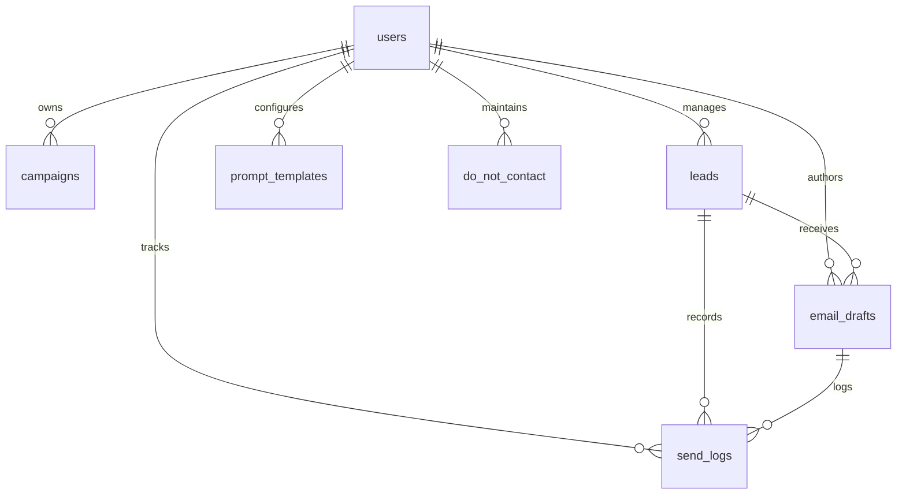
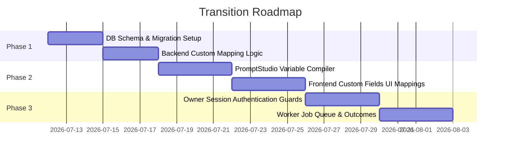

# OutreachOps AI V2: Audit and Transition Plan
**Converting from an ERP-Specific Tool to a Generic, Single-Owner AI Outreach Platform**

This document lays out the architectural audit and transition plan to generalize the OutreachOps AI codebase into a customizable, single-owner outreach B2B platform. 

---

## 1. Repository Directory Structure Map
The current layout of the project:

```text
outreachops-ai/
├── backend/
│   ├── app/
│   │   ├── crud/                 # Database CRUD wrappers
│   │   │   ├── campaigns.py
│   │   │   ├── drafts.py
│   │   │   ├── leads.py
│   │   │   └── prompt_templates.py
│   │   ├── routes/               # API endpoint handlers
│   │   │   ├── analytics.py
│   │   │   ├── campaigns.py
│   │   │   ├── do_not_contact.py
│   │   │   ├── drafts.py
│   │   │   ├── emails.py         # Send executors
│   │   │   ├── health.py
│   │   │   ├── integrations.py
│   │   │   ├── leads.py
│   │   │   ├── logs.py
│   │   │   └── prompts.py        # Studio testing routes
│   │   ├── schemas/              # Pydantic schema validation contracts
│   │   │   ├── campaign.py
│   │   │   ├── do_not_contact.py
│   │   │   ├── email.py
│   │   │   ├── lead.py
│   │   │   ├── log.py
│   │   │   ├── prompt_template.py
│   │   │   └── user.py
│   │   ├── services/             # Integrations (Gmail, Sheets, Gemini, etc.)
│   │   │   ├── email_quality_service.py
│   │   │   ├── error_service.py
│   │   │   ├── gemini_service.py
│   │   │   ├── gmail_service.py
│   │   │   ├── prompt_service.py
│   │   │   ├── rate_limit_service.py
│   │   │   └── sheets_service.py
│   │   ├── utils/
│   │   ├── config.py             # Pydantic BaseSettings config
│   │   ├── database.py           # Supabase & SQLite Fallback client init
│   │   ├── main.py               # FastAPI App instance and lifecycle
│   │   └── seed.py
│   ├── tests/                    # Backend Pytest suite
│   │   ├── conftest.py
│   │   ├── test_draft_parser.py
│   │   ├── test_duplicate_lead_detection.py
│   │   ├── test_email_quality_checker.py
│   │   ├── test_gemini_fallback.py
│   │   └── test_send_guardrails.py
│   ├── Dockerfile
│   └── requirements.txt
├── docs/                         # Architecture & manual pages
├── frontend/                     # Next.js App Router Frontend
│   ├── app/                      # Page components & routing folders
│   │   ├── analytics/
│   │   ├── campaigns/
│   │   ├── dashboard/
│   │   ├── drafts/
│   │   ├── integrations/
│   │   ├── leads/
│   │   ├── login/
│   │   ├── prompt-studio/
│   │   └── settings/
│   ├── components/               # Toast & Layout systems
│   ├── hooks/                    # Reusable React state listeners
│   ├── lib/                      # Supabase client connector
│   ├── types/                    # Shared Typescript mappings
│   ├── tailwind.config.js
│   ├── tsconfig.json
│   └── package.json
└── docker-compose.yml
```

---

## 2. Existing Working Features to Preserve
We must ensure that the following core mechanisms remain untouched, functional, and fully backwards-compatible:
* **Google Sheets API Ingestion**: Automatic parsing and importing of leads from `GOOGLE_SHEET_NAME`.
* **FastAPI Database Failover**: Automatic fallback to the local SQLite database (`local_outreachops.db`) if hosted Supabase tables are unavailable.
* **Outbound Compliance Guardrails**: 
  - **Do-Not-Contact (DNC)** blocklist lookup.
  - **Daily send cap limits** matching campaign settings.
  - **Inter-send delay spacing** (seconds pacing) inside background dispatch loops.
  - **Double-outreach protection** (blocking multiple emails to the same address on a single calendar day).
* **Gemini Copywriting Engine**: Structural fallback sequences with exponential backoff on transient errors (rate limit 429 fallback).
* **Human-in-the-Loop Review Queue**: A stateful drafts table requiring explicit `approved` status before emails are sent.
* **Signature Formatting**: Standardized template compilation mapping owner agency credentials (name, site, phone) into the sign-off block.

---

## 3. ERP-Specific Logic, copy, assumptions, and fallback text
The current codebase assumes a single outreach objective: selling custom ERP integrations. The following occurrences of this logic must be generalized:

### A. Database Columns:
* `leads.erp_approach`: Specifically holds operational module descriptions (e.g. centralized scheduling).
* `leads.website_pain_points`: Holds legacy website audit findings.

### B. Route Assumptions:
* `backend/app/routes/drafts.py`:
  - `generate_drafts` specifically reads `lead.get("erp_approach")`.
  - Fallback email text (lines 152–153) is construction-focused:
    `"Hello Team, Managing construction spreadsheets manually can cause duplication. For {company}, we recommend custom modules like job costing ledgers..."`
* `backend/app/routes/prompts.py`:
  - `test_prompt_simulation` defines a fallback lead with construction attributes: `"erp_approach": "centralized job scheduling, subcontractor tracking"`.
  - `/generate-template` prompts Gemini specifically with `'erp' (custom ERP software proposals based on website and ERP approach)`.

### C. Services & Templates:
* `backend/app/services/prompt_service.py`:
  - `build_erp_prompt` specifically outlines rules like `"Do not overuse buzzwords like 'portal', 'dashboard', or 'ERP'."`
* `backend/app/services/email_quality_service.py`:
  - Evaluates lengths specifically for `website` vs `erp` types.
  - Checks if `erp_approach` keys are included in the generated email body to grade personalization.

---

## 4. Current Database Tables and Relationships
The current schema consists of 8 tables:



* **`users`**: Demarcates owners. (Columns: `id`, `email`, `full_name`, `created_at`).
* **`campaigns`**: Individual campaign configurations. (Columns: `id`, `user_id`, `name`, `campaign_type`, `status`, `daily_send_limit`, `delay_seconds`, `created_at`, `updated_at`).
* **`leads`**: B2B targets. (Columns: `id`, `user_id`, `company_name`, `website`, `industry`, `country`, `city`, `contact_email`, `phone`, `website_pain_points`, `erp_approach`, `lead_status`, `source_sheet_name`, `source_row_number`, `created_at`, `updated_at`).
* **`email_drafts`**: Generated copy reviews. (Columns: `id`, `lead_id`, `user_id`, `email_type`, `subject`, `body`, `status`, `ai_model`, `prompt_version`, `quality_score`, `spam_risk_score`, `personalization_score`, `clarity_score`, `generated_at`, `approved_at`, `sent_at`, `warnings`, `last_error`, `created_at`, `updated_at`).
* **`send_logs`**: Outbound delivery record. (Columns: `id`, `draft_id`, `lead_id`, `user_id`, `recipient_email`, `subject`, `email_type`, `status`, `error_message`, `gmail_message_id`, `sent_at`).
* **`prompt_templates`**: Prompts instructions mapping. (Columns: `id`, `user_id`, `name`, `email_type`, `template_text`, `version`, `is_active`, `created_at`, `updated_at`).
* **`error_logs`**: Background diagnostics. (Columns: `id`, `user_id`, `source`, `message`, `details`, `created_at`).
* **`do_not_contact`**: Global exclusion list. (Columns: `id`, `user_id`, `email`, `reason`, `created_at`).

---

## 5. Current API Inventory
Endpoints registered under `/api/v1`:

* **Leads (`/leads`)**:
  - `GET /` — Fetch all leads
  - `POST /` — Add single lead
  - `PATCH /{id}` — Update lead
  - `DELETE /{id}` — Remove lead
  - `POST /upload` — Upload CSV lead sheets
* **Drafts (`/drafts`)**:
  - `GET /` — Fetch draft queue
  - `POST /generate` — Generate drafts using LLMs
  - `PATCH /{id}` — Edit draft details
  - `POST /approve-all` — Auto-approve pending drafts
  - `POST /{id}/approve` — Approve single draft
  - `POST /{id}/reject` — Reject single draft
  - `POST /{id}/refine` — Ask Gemini to adjust tone/length
  - `POST /{id}/send` — Send email immediately
* **Campaigns (`/campaigns`)**:
  - `GET /` — Fetch campaigns
  - `GET /active` — Get active settings
  - `POST /` — Create campaign
  - `PATCH /{id}` — Update settings
  - `DELETE /{id}` — Remove campaign
  - `POST /{id}/pause` — Pause campaign queue
  - `POST /{id}/resume` — Resume campaign queue
* **Prompts (`/prompts`)**:
  - `GET /` — Fetch prompt templates
  - `GET /active` — Fetch active template
  - `POST /` — Save custom template
  - `POST /test` — Test prompt simulation
  - `POST /generate-template` — Generate prompt templates via AI
* **Integrations (`/integrations`)**:
  - `POST /sheets/import` — Run Google Sheet leads sync
  - `GET /sheets/status` — Get sheet API connection state
  - `GET /gmail/status` — Verify Gmail OAuth token state
  - `POST /gmail/connect` — Initialize Gmail auth loop
  - `GET /gemini/status` — Verify Gemini API connectivity
* **Analytics (`/analytics`)**:
  - `GET /summary` — Retrieve dashboard counts (sent, failed, remaining, approved)
  - `GET /charts` — Retrieve historic outreach logs chart data
* **Logs (`/logs`)**:
  - `GET /` — Retrieve errors and status activity events
* **Health (`/health`)**:
  - `GET /` — Check backend connection

---

## 6. Current Frontend Route Inventory
All frontend routes are structured under the Next.js App Router (`frontend/app/`):

* **`page.tsx`** (`/`): The core Authentication login/sign-up screen with mock-bypass switches.
* **`/dashboard`**: High-fidelity KPI telemetry dashboard displaying campaign stats, volume charts, and recent activity logs.
* **`/leads`**: Leads Database view featuring lead creation, edit forms, CSV uploads, Sheets Sync triggers, and the AI Bulk generation wizard.
* **`/drafts`**: Review queue display showcasing quality metrics, detailed body warnings, manual editing modals, prompt refiner triggers, and individual dispatch controls.
* **`/campaigns`**: Daily Cap settings configuration, delay pacing, and Pause/Resume/Save triggers.
* **`/prompt-studio`**: Configuration studio for prompt editing, variable checking, and prompt testing simulations.
* **`/integrations`**: Integration checklist tracking Google Sheets, Gmail OAuth, and Gemini API statuses.
* **`/settings`**: Profile variables control panel (signatures, user information, etc.).

---

## 7. Current Data Flow

```text
[Upload CSV / Google Sheet]
             │
             ▼
      [leads Table]
             │
             ▼
   [AI Bulk Generation] ──► [Gemini API / Fallback Mock Engine]
                                      │
                                      ▼
                             [email_drafts Table] (status='draft')
                                      │
                                      ▼
                            [Human Queue Review]
                                      │
                                      ▼
                             [Approved Drafts] (status='approved')
                                      │
                                      ▼
                        [Campaign Scheduler Daemon]
                                      │
            ┌─────────────────────────┴─────────────────────────┐
            ▼                                                   ▼
     (If Daily Cap Hit)                                (If Capacity Available)
            │                                                   │
   [Hold in Queue Loop]                                 [DNC & Safety Check]
                                                                │
                                                                ▼
                                                        [Gmail API Send]
                                                                │
                                                                ▼
                                                       [send_logs Recorded]
```

---

## 8. Current Security Weaknesses
* **Hardcoded Demo User ID**: The entire backend bypasses authentication by declaring `DEMO_USER_ID = "d3b07384-d113-4ec2-a72d-86284f1837b2"`.
* **Zero Backend Route Authentication**: None of the backend API routes check authorization headers, bearer tokens, or session state. Anyone who accesses the API port directly can modify leads or dispatch campaigns.
* **Client-Only Local Mock Bypass**: The frontend determines whether to use Supabase authentication entirely based on client-side environment check: `if (!supabase) { router.push("/dashboard"); }`.
* **Unencrypted Pickled OAuth Tokens**: The Google API credentials PKL file (`gmail_token.pkl`) is stored directly on the backend server's file system without database encryption.

---

## 9. Current Test Coverage
Tests are located in `backend/tests/` and run using `pytest`:
* **`test_draft_parser.py`**: Validates the parsing of structured LLM outputs into Subject and Body blocks, including markdown stripping.
* **`test_duplicate_lead_detection.py`**: Ensures sheets service filters existing leads.
* **`test_email_quality_checker.py`**: Validates spam word detections, signature inclusion, and short-email warnings.
* **`test_gemini_fallback.py`**: Verifies fallback sequence execution if the first model fails.
* **`test_send_guardrails.py`**: Verifies that daily cap checks block campaign sends if the cap is hit.

---

## 10. Target V2 Architecture
The transition from an ERP-specific script to a generic custom-fields B2B outreach platform requires the following architectural adjustments:

* **Generic Campaigns & Custom Objectives**: Campaigns will define their own goals, tone angles, and custom prompts, moving away from hardcoded website vs ERP rules.
* **Dynamic Lead Custom Fields**: The `leads` table will store custom variables (e.g. target systems, specific company challenges) in a flexible `custom_fields` JSONB column.
* **Universal Custom Mapping Ingestor**: The CSV and Sheets parsers will map column headers to custom variable keys, making imports flexible.
* **Dynamic Prompt Variables**: Prompt templates will dynamically replace bracketed keys (e.g., `{company_name}`, `{custom_variable_name}`) using values fetched from the lead's custom fields.
* **Lead Fit Scoring & Research Summaries**:
  - Gemini will evaluate lead fit score (0-100) based on custom variables.
  - LLMs will output a brief personalization summary to justify the score.
* **Generation Jobs**: Bulk generation tasks will execute in background threads tracked by a structured job queue, rather than locking requests.
* **A/B Experiments**: Approved drafts can be segmented into A/B splits to test different copy variables and optimize metrics.
* **Outcome Analytics**: Tracks real outcomes (e.g. replies, positive sentiment, meetings booked) using reply detection.

---

## 11. Proposed Database Migrations (Additive & Reversible)

We will introduce two migrations to generalize leads, campaigns, and outcomes without losing existing data:

### Migration 1: Add Custom Mappings and Variable Store
```sql
-- Add custom fields to leads without deleting legacy columns
ALTER TABLE leads ADD COLUMN IF NOT EXISTS custom_fields JSONB DEFAULT '{}'::jsonb;
ALTER TABLE leads ADD COLUMN IF NOT EXISTS fit_score INTEGER DEFAULT NULL;
ALTER TABLE leads ADD COLUMN IF NOT EXISTS personalization_summary TEXT DEFAULT NULL;

-- Add campaign objectives, custom variables, and template mappings to campaigns
ALTER TABLE campaigns ADD COLUMN IF NOT EXISTS campaign_objective TEXT DEFAULT 'ERP Software Outreach';
ALTER TABLE campaigns ADD COLUMN IF NOT EXISTS custom_variables TEXT[] DEFAULT ARRAY['erp_approach'];
ALTER TABLE campaigns ADD COLUMN IF NOT EXISTS active_prompt_template_id UUID;
```

### Migration 2: Add Generation Jobs, Sequences, and Outcome Tracking
```sql
-- Create table for Background Generation Jobs
CREATE TABLE IF NOT EXISTS generation_jobs (
    id UUID PRIMARY KEY DEFAULT gen_random_uuid(),
    campaign_id UUID REFERENCES campaigns(id) ON DELETE CASCADE NOT NULL,
    status TEXT NOT NULL DEFAULT 'pending', -- pending, running, completed, failed
    total_leads INTEGER DEFAULT 0,
    processed_leads INTEGER DEFAULT 0,
    failed_leads INTEGER DEFAULT 0,
    error_message TEXT,
    created_at TIMESTAMPTZ DEFAULT now(),
    updated_at TIMESTAMPTZ DEFAULT now()
);

-- Add reply and sentiment outcomes to send logs and drafts
ALTER TABLE send_logs ADD COLUMN IF NOT EXISTS replied_at TIMESTAMPTZ DEFAULT NULL;
ALTER TABLE send_logs ADD COLUMN IF NOT EXISTS sentiment TEXT DEFAULT NULL; -- positive, neutral, negative

-- Add outcome tracking to email drafts
ALTER TABLE email_drafts ADD COLUMN IF NOT EXISTS variant_group TEXT DEFAULT 'A'; -- A/B Testing
```

---

## 12. Proposed API Contracts
We will update or add these endpoints under `/api/v1`:

### Leads:
* `POST /leads/upload` — Accepts CSV/XLSX and a custom JSON mapping (e.g. `{"Company Name": "company_name", "Email": "contact_email", "ERP painpoints": "erp_approach"}`). Saves mapped variables into the `custom_fields` JSONB column.

### Campaigns:
* `POST /campaigns/{id}/clone` — Clones a campaign configuration, its objectives, and its active prompt templates.
* `POST /campaigns/{id}/generate-job` — Spawns a background generation job for all leads attached to the campaign. Returns a `job_id`.
* `GET /campaigns/jobs/{job_id}` — Returns status updates for the background runner.

### Prompt Templates:
* `POST /prompts/test` — Accepts custom prompt strings and a lead ID, dynamically compiles braces (e.g., `{company_name}`, `{custom_field}`) and runs tests.

### Outcome Analytics:
* `GET /analytics/outcomes` — Returns performance metrics segmented by campaign, objective, and A/B variant.
* `POST /emails/reply-webhook` — Simulates or handles inbound Gmail reply webhooks to log outcomes.

---

## 13. Background-Worker Architecture

To keep bulk sends stable, we will run queue execution in a non-blocking background thread:

```text
[Bulk Dispatch Request]
          │
          ▼
 [Spawn Background Job] ──► [Write Job Status: 'running']
                                      │
                                      ▼
                        [Fetch Active Campaign settings]
                                      │
                                      ▼
                     [Iterate through Approved Drafts]
                                      │
                   ┌──────────────────┴──────────────────┐
                   ▼                                     ▼
          [Check Daily Cap]                     [Paced Dispatch Loop]
                   │                                     │
           (Limit Exceeded)                      [Gmail Send API]
                   │                                     │
          [Pause Job Queue]                     [Sleep delay_seconds]
                                                         │
                                                         ▼
                                                [Log Sent / Error]
```

* **Executor**: Background tasks spawned using FastAPI's `BackgroundTasks` library or a custom runner thread.
* **Concurrency Lock**: Uses a database status lock on campaigns to prevent multiple worker loops from running simultaneously.
* **Rate Limits**: Respects the `delay_seconds` spacing setting.

---

## 14. Single-Owner Authentication Architecture

Because this is a **single-owner application** (not a multi-tenant SaaS), we do not need registration gates, invitations, or subscriptions. We only need to secure the owner account.

```text
[Owner Login Request] ──► [Verify credentials via Supabase Auth]
                                      │
                             ┌────────┴────────┐
                             ▼                 ▼
                       (Credentials OK)   (Failure)
                             │                 │
                      [Generate JWT]      [Return 401]
                             │
                             ▼
               [Save Session in Cookies]
                             │
                             ▼
         [Enforce FastAPI Route Auth Dependencies]
```

* **Authentication Gate**: Enforces standard JSON Web Tokens (JWT) or session cookies verified using a FastAPI dependency:
  ```python
  async def get_current_owner(credentials: HTTPAuthorizationCredentials = Depends(auth_scheme)):
      # Checks token validity against single owner schema
      ...
  ```
* **Local Mode Bypass**: In `DEMO_MODE=true` (with empty Supabase config), auth dependencies return the default mock user ID automatically to retain a credential-free local experience.

---

## 15. Implementation Phases Order



### Phase 1: Database Migration & Core Generic Custom Fields Ingestion
* Apply additive schema migrations.
* Update `sheets_service` and `leads` CSV route to accept custom mappings and write parameters to `custom_fields` JSONB.

### Phase 2: Dynamic Template Compilation & UI Customization
* Update `prompt_service` to compile prompt brackets dynamically.
* Generalize `email_quality_service` length checks and personalization verification.
* Refactor the Leads table, Creation Modal, and Prompt Studio to display custom variables instead of hardcoded ERP fields.

### Phase 3: Single-Owner Session Auth Guards & Analytics Outcomes
* Secure FastAPI routes with authentication dependencies.
* Build the background task status queue.
* Integrate A/B test splits, outcome analytics, and response logs.

---

## 16. Files Expected to Change

### Backend:
* `backend/app/database.py` (Add SQLite mock tables upgrade code)
* `backend/app/routes/leads.py` (Custom CSV mapping logic)
* `backend/app/routes/drafts.py` (Dynamic generation, A/B splitting)
* `backend/app/routes/prompts.py` (General simulation compilation)
* `backend/app/routes/campaigns.py` (Clone campaign settings, edit objective variables)
* `backend/app/services/prompt_service.py` (Template compiler)
* `backend/app/services/email_quality_service.py` (General grading guidelines)
* `backend/app/services/sheets_service.py` (Flexible column ingest mappings)
* `backend/app/schemas/lead.py` / `campaign.py` (Contract schemas validation updates)
* `backend/tests/` (Refactored test configurations)

### Frontend:
* `frontend/app/page.tsx` (AuthPage setup)
* `frontend/app/dashboard/page.tsx` (Outcomes analytics telemetry charts)
* `frontend/app/leads/page.tsx` (CSV Upload mapping configurator UI)
* `frontend/app/drafts/page.tsx` (A/B label filters, editing metrics)
* `frontend/app/prompt-studio/page.tsx` (Variable indicators and dynamic testing simulator)
* `frontend/app/campaigns/page.tsx` (Campaign target objectives configurator)

---

## 17. Migration and Rollback Risks
* **SQLite Fallback Type Compatibilities**: Local SQLite does not native-support `JSONB`. The database connector (`database.py`) must serialize/deserialize JSON strings to strings transparently to maintain full local fallback capabilities.
* **Lead Data Loss**: Modifying the leads CSV parser must not overwrite legacy columns. Legacy data mapping preserves continuity.
* **Invalid Template Placeholders**: Compiling dynamic braces could crash if users insert brackets like `{non_existent_key}`. The prompt compiler must fall back to blank spaces rather than raising validation exceptions.

---

## 18. Excluded Features (Single-Owner Constraints)
Because this B2B tool is explicitly designed for a **single owner**, the following features are out of scope:
* **Multi-tenant Routing**: No workspace separation databases, tenant schema segmentation, or isolated team dashboards.
* **Subscriptions & Billing**: No Stripe, payment hooks, credit restrictions, or subscription checks.
* **Team Roles**: No invitations links, access levels (Admin vs Member), or activity log attribution per teammate.
