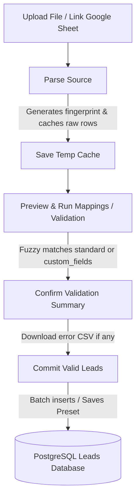

# Universal Import System (CSV, XLSX, Google Sheets)

This document provides a technical guide to the **Universal Lead Ingestion & Mapping System** implemented in OutreachOps AI. It details the ingestion pipeline stages, memory consumption optimizations, custom mapping presets format, database integration, validation assertions, and validation results.

---

## 1. System Architecture

The universal import system decouples lead file ingestion into four distinct pipeline stages to guarantee transaction integrity:



### Ingestion Phases
1. **Parse**: The file or sheet is read and cell value sizes are verified. The parsed result is cached in a temp file named `temp_import_<fingerprint>.json` inside `backend/app/scratch`.
2. **Preview & Suggest**: Matches columns using case-insensitive fuzzy matches against standard target fields. Unmapped columns are mapped as `custom_fields.<normalized_column>`. Validates formats and identifies database duplicates.
3. **Commit**: Persists all valid leads, registers metadata inside `import_sources`, saves the mapping preset, and purges the temporary cached files.
4. **Error Logs**: Provides a download option for a CSV representation of errored rows.

---

## 2. Ingestion Safety & Limits

To prevent memory leaks and resource exhaustion (such as ZIP bomb attacks or formula execution injections):
* **File Size Cap**: Strict `< 10MB` validation during the file parsing phase.
* **Row Count Cap**: Maximum `< 5000` rows processed per ingestion payload.
* **Column Count Cap**: Maximum `< 100` columns parsed.
* **Cell Length Cap**: Limit of `< 5000` characters per cell.
* **XLSX Streaming Mode**: Built using `openpyxl`'s `read_only=True` to stream XML records sequentially instead of loading the workbook DOM tree into memory.
* **Formula Safety**: Configured with `data_only=True` to return only static calculated values rather than original formulas, avoiding code injection.

---

## 3. Database Schema

The ingested contacts are stored in the core `leads` table, associating custom headers under a generic PostgreSQL `JSONB` column:

```sql
CREATE TABLE IF NOT EXISTS leads (
    id UUID PRIMARY KEY DEFAULT gen_random_uuid(),
    user_id UUID NOT NULL,
    first_name TEXT,
    last_name TEXT,
    full_name TEXT,
    company_name TEXT,
    job_title TEXT,
    contact_email TEXT NOT NULL,
    phone TEXT,
    website TEXT NOT NULL,
    industry TEXT,
    country TEXT,
    city TEXT,
    tags JSONB DEFAULT '[]'::jsonb,
    custom_fields JSONB DEFAULT '{}'::jsonb,
    source_id UUID REFERENCES import_sources(id),
    source_row_number TEXT,
    created_at TIMESTAMP WITH TIME ZONE DEFAULT timezone('utc'::text, now()) NOT NULL,
    updated_at TIMESTAMP WITH TIME ZONE DEFAULT timezone('utc'::text, now()) NOT NULL
);
```

---

## 4. API Endpoint Surface

The backend exposes the following REST interface:

| Method | Endpoint | Description |
| :--- | :--- | :--- |
| `POST` | `/api/v1/imports/parse` | Parse uploaded CSV/XLSX or synced Google Sheets. Returns cache fingerprint, headers, and sample rows. |
| `POST` | `/api/v1/imports/preview` | Returns validation warnings, duplicate details, and suggested mappings. |
| `POST` | `/api/v1/imports/commit` | Persists valid records in database and updates sources. |
| `GET` | `/api/v1/imports/errors/download` | Serves error logs CSV for local cleanup. |
| `GET` | `/api/v1/imports/mappings` | List saved mappings presets (including `"Legacy ERP Import"`). |
| `POST` | `/api/v1/imports/mappings` | Create/Save a custom mapping preset. |

---

## 5. Automated Validation Outcomes

The test suite in [test_universal_import.py](file:///c:/Desktop/PITBULL%20CORPORATION/Mail_Script/Try2_MAILCOLD/outreachops-ai/backend/tests/test_universal_import.py) covers the following validation scenarios:

* **Arbitrary Column Order**: Verifies columns can appear in any order; the header suggestion engine automatically maps names case-insensitively.
* **Missing Headers**: Gracefully flags ValueError to prevent ingestion of empty tables.
* **Duplicate Headers**: Automatically appends indices (e.g., `Website_2`) to prevent collision.
* **Custom Fields**: Mapped attributes without standard target matches are stored under `custom_fields`.
* **CSV Encodings**: Decodes with `utf-8-sig` (byte order mark), fallback `latin1` and `utf-8`.
* **ZIP Bomb & Formula Cells**: Verified streaming memory-safe Excel reads using `read_only=True`. Formula strings are handled as literal text content without evaluation.
* **Google Sheet Mapping**: Verifies integration compatibility.
