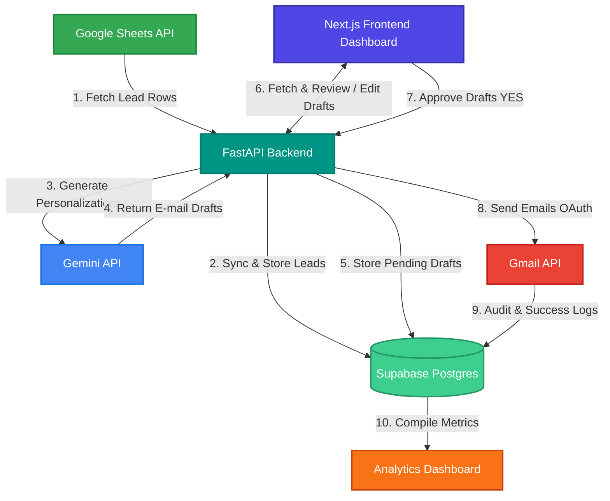

# OutreachOps AI — System Architecture

This document describes the end-to-end data flow and architectural design of OutreachOps AI, a B2B cold email automation platform with a human-in-the-loop review workflow.

## End-to-End System Flow

The data moves sequentially through the system according to the following workflow:

---

## Detailed Component Flow

### 1. Lead Ingestion (Google Sheets API)
- **Source**: Target Google Sheet containing columns for Website URL, website issues/pain points, and ERP pitch approach (similar to columns A-E in your existing script).
- **Service**: `GoogleSheetsService` in backend.
- **Process**: The backend queries the Google Sheets API via a service account or user credentials, retrieves new rows, validates email fields, and checks for duplicates.

### 2. Database Layer (Supabase Postgres)
- **Role**: Serves as the single source of truth for leads, drafts, logs, and analytics.
- **Benefits**: Real-time subscriptions let the Next.js frontend update dynamically when a draft status changes or when a background ingestion completes.
- **Tables**:
  - `leads`: Stores contact info, target website, and initial inputs.
  - `email_drafts`: Holds AI-generated subjects, bodies, approvals (YES/NO/PENDING), and send status.
  - `delivery_logs`: Captures message IDs, time stamps, and API error logs.

### 3. AI Personalization Engine (Gemini API)
- **Models**: `gemini-2.5-flash` or `gemini-2.5-flash-lite`.
- **Logic**: Structured prompts feed website issues and ERP business angles to generate target copy variants.
- **Fallback Strategy**: An ordered model fallback list prevents temporary 503 high-demand exceptions from stopping operations.

### 4. Human-In-The-Loop Review (Draft Queue)
- **Frontend Dashboard**: Lists all generated drafts.
- **Interactions**:
  - **Edit**: Users can tweak the subject line or email body.
  - **Regenerate**: Triggers another Gemini call with customized guidelines.
  - **Approve**: Marks `approve_website` or `approve_erp` to `YES`.

### 5. Email Dispatcher (Gmail API OAuth)
- **Connection**: OAuth 2.0 Web Client authentication (Gmail User context).
- **Process**: A background task picks up approved (`YES`) drafts and dispatches them via Gmail APIs using MIME multipart payloads.
- **Rate-Limiting**: Inter-send delays (default: 5 seconds) prevent trigger-happy suspensions.

### 6. Audit Logs & Analytics
- **Telemetry**: Tracks delivery states (`SENT`, `FAILED`, `PENDING`) and records trace logs for API errors.
- **Aggregations**: Computes metrics like conversion funnel statistics, send success rates, and prompt performance metrics for display on the front-end.
