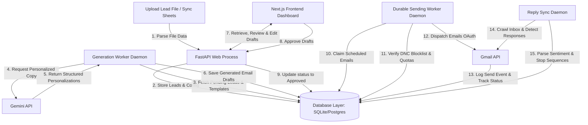

# OutreachOps AI — System Architecture

This document describes the architectural design, core subsystems, data flow cycles, and security boundaries of OutreachOps AI.

---

## 1. End-to-End System Data Flow

The data flow cycle traces lead ingestion to outbound email dispatch and telemetry compilation:



---

## 2. Subsystem Components

### I. Frontend (Next.js Dashboard)
* Built using Next.js 14 App Router, TypeScript, and Tailwind CSS.
* **Dashboard View**: Renders charts (Recharts) detailing lead progress, delivery funnels, and response counts.
* **Lead Manager**: Interface for universal spreadsheets upload, columns mapping wizard, and Google Sheets sync.
* **Draft review queue**: Detailed review pane to view email quality metrics (clarity, personalization, spam risk), edit subjects/bodies, and approve drafts in bulk.
* **Queue Observability**: Live diagnostics view of background threads, heartbeat logs, and operational worker toggles (Pause/Resume/Drain).

### II. API Server (FastAPI Backend Web Process)
* Lightweight FastAPI service executing on a Uvicorn process.
* Exposes RESTful endpoints for CRUD operations (campaigns, settings, leads, drafts, DNC).
* **Correlation ID Propagation**: `LoggingMiddleware` captures or assigns `X-Correlation-ID` headers to all requests, setting it in `contextvars` to group trace logs.
* **Authentication Barrier**: Access token validation in `require_owner` verifying Supabase JWT credentials.

### III. Database Layer (SQLite / Supabase Postgres)
* **Demo/Development Fallback**: Uses local SQLite database (`local_outreachops.db`) if `ENV=test` to permit offline showcases.
* **Production SQL**: Supabase Postgres with strict **Row-Level Security (RLS)** policies. All data modifications are scoped to the authenticated `user_id` context (`auth.uid() = user_id`).

### IV. Generation Worker Daemon
* Separate concurrent daemon thread (`GenerationWorker`) polling the database for pending generation tasks.
* **Claim Mutex**: Utilizes atomic row locking or optimistic updates (status changes to `processing`) to guarantee mutual exclusion in multi-process setups.
* **Fallback Strategy**: Retries failed calls across the configured `GEMINI_MODEL_LIST` hierarchy with jittered exponential backoffs.

### V. Sending Worker Daemon
* Concurrent daemon thread (`DurableSendingWorker`) responsible for outbox delivery.
* **Guardrails verification**: Before dispatch, checks Daily Cap Limits, Inter-send Spacing Delays, Same-Day double contact locks, and DNC blocklists.
* **Dispatches**: Constructs MIMEMultipart MIME payloads and sends them via Gmail endpoints using owner credentials.

### VI. Gmail Reply Sync Daemon
* Background daemon thread (`GmailSyncService`) executing recurring sync ticks.
* Crawls recent Gmail inbox threads matching the campaign recipient list.
* Parses emails through sentiment classifier rules. If a reply is identified, transitions the lead's state to `stopped`, canceling all pending sequence steps.

---

## 3. Security Boundaries & Isolation

```text
       PUBLIC WEB
           │
           ▼
┌──────────────────────┐  JWT Auth  ┌────────────────────────┐
│ Next.js Frontend App │ ─────────> │ FastAPI API Gateway    │
└──────────────────────┘            └────────────────────────┘
                                                 │
                             ┌───────────────────┴───────────────────┐
                             ▼                                       ▼
                 ┌──────────────────────┐                ┌──────────────────────┐
                 │ Supabase Postgres    │                │ SQLite Local Database│
                 │ (RLS Scoped Policies)│                │ (Test/Demo Mode)     │
                 └──────────────────────┘                └──────────────────────┘
```

* **Client isolation**: The frontend app has no direct write access to database schemas. All mutations pass through RLS rules or the API controller layer.
* **Credential Vaulting**: Tokens, SMTP certificates, and database service keys are stored inside server-side environment variables and are never sent to the client.
