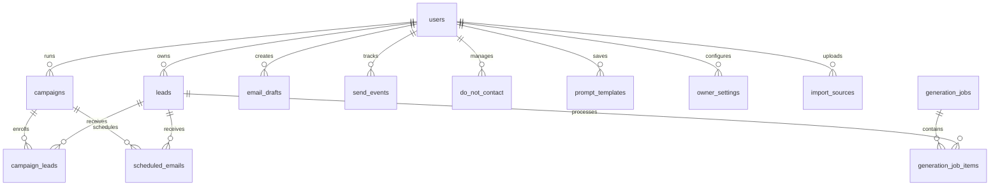

# OutreachOps AI — Database Schema & Migration Guide

This document details the PostgreSQL/SQLite database tables, relationships, indexes, Row-Level Security (RLS) configurations, and schema migration guides.

---

## 1. Entity-Relationship Diagram



---

## 2. Table Definitions (OutreachOps AI v2)

### I. `owner_settings`
Tracks solo agency configuration and operational daemon controls.
* `id` (TEXT, Primary Key)
* `owner_id` (TEXT, Unique, referencing `users.id`)
* `business_name` (TEXT)
* `website` (TEXT)
* `sender_name` (TEXT)
* `sender_email` (TEXT)
* `timezone` (TEXT, Default `'UTC'`)
* `daily_send_limit` (INTEGER, Default `50`)
* `minimum_send_spacing_seconds` (INTEGER, Default `60`)
* `allowed_send_start` (TEXT, Default `'09:00'`)
* `allowed_send_end` (TEXT, Default `'17:00'`)
* `banned_phrases` (TEXT, JSON array, Default `'[]'`)
* `generation_worker_paused` (INTEGER, Default `0`)
* `sending_worker_paused` (INTEGER, Default `0`)
* `queue_drain_enabled` (INTEGER, Default `0`)

### II. `scheduled_emails`
Outbox queue tracking scheduled campaign messages.
* `id` (TEXT, Primary Key)
* `user_id` (TEXT, referencing `users.id`)
* `campaign_id` (TEXT, referencing `campaigns.id`)
* `lead_id` (TEXT, referencing `leads.id`)
* `draft_id` (TEXT, referencing `email_drafts.id`)
* `scheduled_for` (TEXT, timestamp)
* `status` (TEXT) - `pending`, `processing`, `sent`, `failed`, `retry`, `cancelled`
* `attempts` (INTEGER, Default `0`)
* `last_error` (TEXT)

### III. `generation_jobs`
Executes asynchronous batch generation jobs.
* `id` (TEXT, Primary Key)
* `user_id` (TEXT)
* `campaign_id` (TEXT)
* `status` (TEXT) - `pending`, `running`, `completed`, `failed`
* `total` (INTEGER, Default `0`)
* `queued` (INTEGER, Default `0`)
* `processing` (INTEGER, Default `0`)
* `completed` (INTEGER, Default `0`)
* `failed` (INTEGER, Default `0`)

### IV. `generation_job_items`
Tasks representing an individual lead draft generation request.
* `id` (TEXT, Primary Key)
* `job_id` (TEXT, referencing `generation_jobs.id`)
* `lead_id` (TEXT, referencing `leads.id`)
* `status` (TEXT) - `pending`, `processing`, `completed`, `failed`
* `last_error` (TEXT)

### V. `import_sources`
Tracks spreadsheets uploaded for mapping.
* `id` (TEXT, Primary Key)
* `user_id` (TEXT)
* `filename` (TEXT)
* `row_count` (INTEGER)

### VI. `import_mappings`
Stores custom mappings for spreadsheet columns.
* `id` (TEXT, Primary Key)
* `user_id` (TEXT)
* `mapping_json` (TEXT, JSON dictionary mapping headers to lead attributes)

---

## 3. Database Indexing

The following indexes are configured to ensure rapid pagination and query lookups:
1. `idx_leads_user_status`: Composite index on `(user_id, lead_status)` in the `leads` table.
2. `idx_drafts_user_status`: Composite index on `(user_id, status)` in the `email_drafts` table.
3. `idx_scheduled_emails_status`: Composite index on `(status, scheduled_for)` in `scheduled_emails`.
4. `idx_send_events_campaign_lead`: Composite index on `(campaign_id, lead_id)` in `send_events`.

---

## 4. Migration Guide (From V1 to V2)

To upgrade your existing v1 database to support the new features, run the migration script:

```sql
-- 1. Create owner_settings table
CREATE TABLE IF NOT EXISTS owner_settings (
    id TEXT PRIMARY KEY,
    owner_id TEXT UNIQUE NOT NULL,
    business_name TEXT,
    website TEXT,
    sender_name TEXT,
    sender_email TEXT,
    sender_phone TEXT,
    default_signature TEXT,
    brand_voice TEXT,
    default_tone TEXT,
    default_cta TEXT,
    default_language TEXT DEFAULT 'en',
    timezone TEXT DEFAULT 'UTC',
    daily_send_limit INTEGER DEFAULT 50,
    minimum_send_spacing_seconds INTEGER DEFAULT 60,
    allowed_send_start TEXT DEFAULT '09:00',
    allowed_send_end TEXT DEFAULT '17:00',
    required_footer TEXT,
    banned_phrases TEXT DEFAULT '[]',
    generation_worker_paused INTEGER DEFAULT 0,
    sending_worker_paused INTEGER DEFAULT 0,
    queue_drain_enabled INTEGER DEFAULT 0,
    created_at TEXT DEFAULT CURRENT_TIMESTAMP,
    updated_at TEXT DEFAULT CURRENT_TIMESTAMP
);

-- 2. Create scheduled_emails table
CREATE TABLE IF NOT EXISTS scheduled_emails (
    id TEXT PRIMARY KEY,
    user_id TEXT NOT NULL,
    campaign_id TEXT NOT NULL,
    lead_id TEXT NOT NULL,
    draft_id TEXT,
    scheduled_for TEXT NOT NULL,
    status TEXT DEFAULT 'pending',
    attempts INTEGER DEFAULT 0,
    last_error TEXT,
    gmail_message_id TEXT,
    gmail_thread_id TEXT,
    sequence_step_id TEXT,
    created_at TEXT DEFAULT CURRENT_TIMESTAMP,
    updated_at TEXT DEFAULT CURRENT_TIMESTAMP
);

-- 3. Create indices for performance optimization
CREATE INDEX IF NOT EXISTS idx_scheduled_emails_lookup 
ON scheduled_emails (status, scheduled_for);

CREATE INDEX IF NOT EXISTS idx_leads_user_status_v2
ON leads (user_id, lead_status);
```
